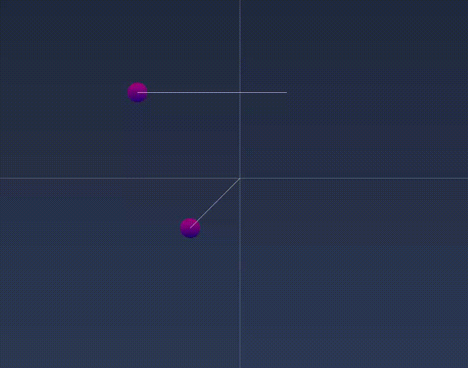
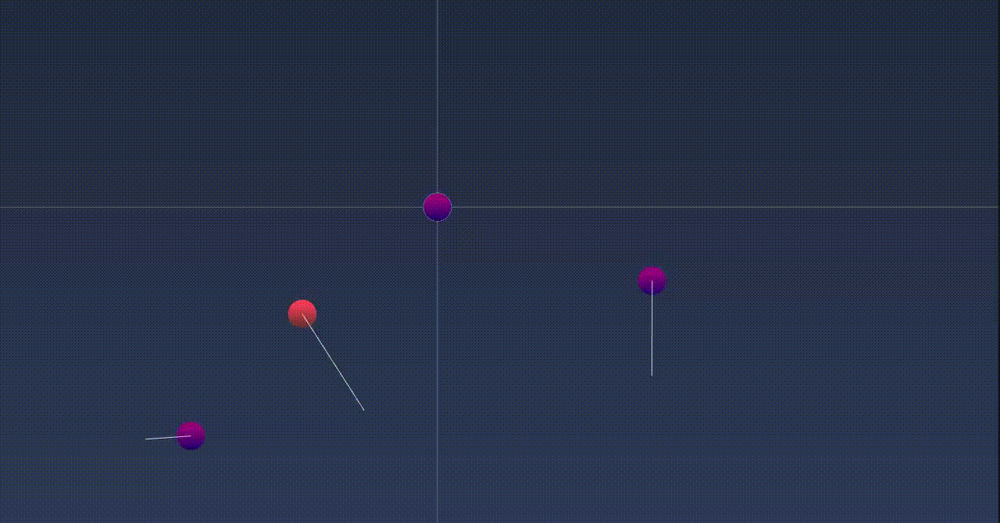
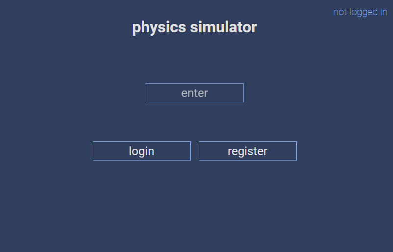
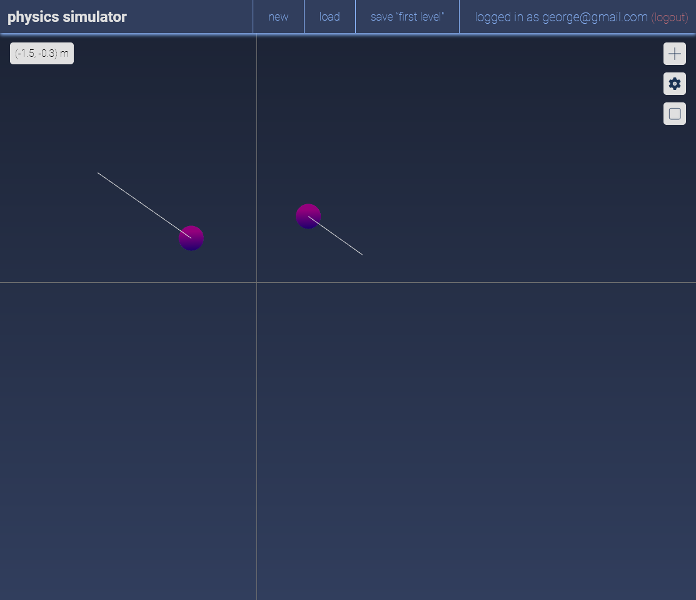
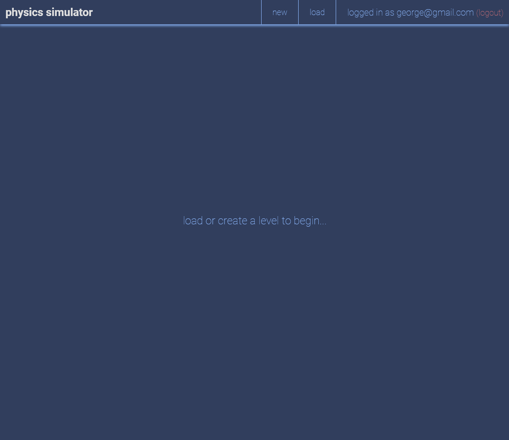
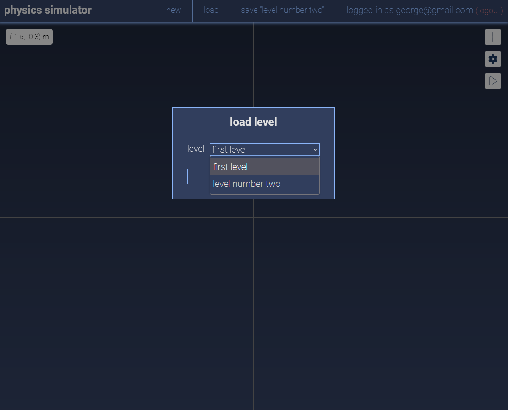
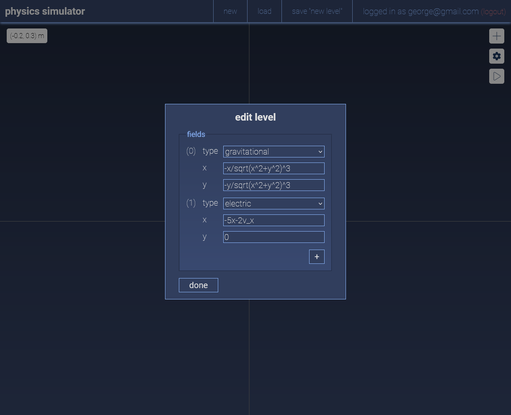
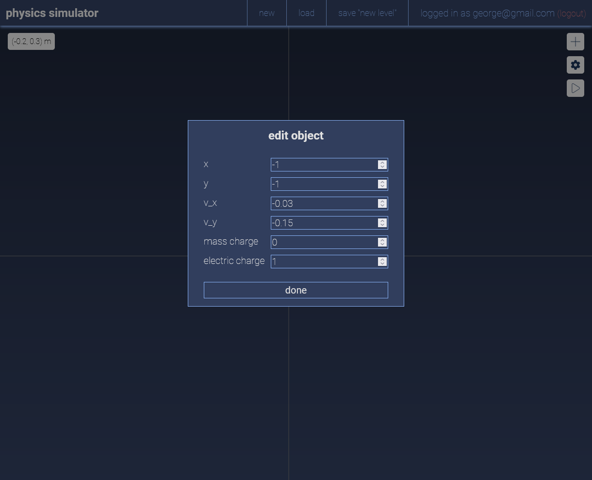

# physics-simulator

## how-to

- click a particle to select it
- drag an object to change its position
- shift-drag an object to change its initial velocity
- click the canvas to remove the current particle selection
- press the gear icon with a particle (the canvas) selected to edit the particle properties (background fields)
    - the background field editor can use three parameters: $x$, $y$, $v_x$ (v_x), $v_y$ (v_y), and $t$ in the field calculation
    - $x$ and $y$ are the positions of the particle
    - $v_x$ and $v_y$ are the velocities of the particle
    - $t$ is the time since simulation has begun
- press the play/stop button to play/stop the simulation
- levels can be loaded and saved after being created using the buttons in the header of the simulator

## demos

a critically dampened harmonic oscillator (top) and a non-isotropic harmonic oscillator in two dimensions (bottom)

many small-mass bodies (*e.g.,* planets) orbiting a central highly massive body (*e.g.,* the sun)

## screenshots

### title screen

### simulator

